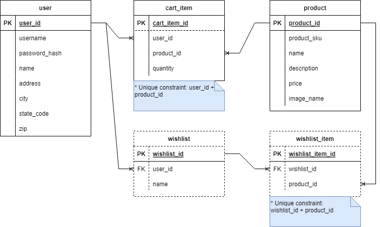

# Module Two final project

The Module Two final project is an opportunity to apply the programming skills and knowledge you've learned in this module. In particular, you'll demonstrate the following:

* Using the DAO pattern to access data in a SQL database
* Writing code to get data from a REST API
* Implementing server-side code to create a RESTful API
* Using Auth to control access to REST API endpoints

## Application

In this project you'll build a REST API to support an e-commerce shopping cart.

The [Requirements](#requirements) section later in this document describes the endpoints needed.

## Database setup

To run the application, you must first create the `m2_final_project` database. Then run the `database/m2_final_project.sql` script to create the tables with some test users and data.

> Note: The script creates two users for use in testing, `user` and `admin`, which both have the password: `password`.

## Starting code

Begin by opening the Module Two final project in IntelliJ and reviewing the starting code.

The project contains code to support user authentication. This code includes Javadoc comments to explain the purpose of the classes and methods.

## Requirements

The requirements are for a RESTful web API only. There are no requirements for a user interface. Perform testing of the required endpoints by using Postman.

There are three groupings of requirements:

- **Provided**: documents the provided features in the starter code
- **Required**: features required to successfully complete the project
- **Bonus**: optional work that allows you to extend the project to further develop your skills

### Provided

Use cases:
1. As a user of the system, I need to be able to register myself with a username, address information, and password.
1. As a user of the system, I need to be able to log in using my registered username and password.

API endpoints:
1. POST `/register` (Provided Use Case 1)
1. POST `/login` (Provided Use Case 2)

### Required

Use cases:
1. As an unauthenticated user, I can see a list of products for sale.
1. As an unauthenticated user, I can search for a list of products by name or SKU.
1. As an unauthenticated user, I can view additional information about a specific product (product detail).
1. As a user, I can view my shopping cart and see the following details:
    * The list of products, quantities, and prices in my cart
    * The subtotal of all products in my cart
    * The tax amount (in U.S. dollars) charged for my state
        - Obtain the tax rate from an external API using the URL: https://teapi.netlify.app/api/statetax?state=[state-code].
        - The state code is part of the user address information.
        - The tax rate returned from the API is a percentage. Convert this to a decimal value to use in calculating the tax amount.
    * The cart total, which is the subtotal plus the amount of tax
1. As a user, I can add a product to my shopping cart.
    * If the product is already in my cart, increase the quantity appropriately.
    * The quantity added must be positive.
1. As a user, I can remove a product from my shopping cart. This removes the item from the cart entirely, regardless of the quantity in the cart.
1. As a user I can clear my cart, removing all the items from the cart.

API endpoints:
1. GET `/products` - get the list of products (Required Use Case 1)
1. GET `/products?sku={product_sku}&name={product_name}` - search for products (Required Use Case 2)
1. GET `/products/{id}` - get a single product (Required Use Case 3)
1. GET `/cart` - get the user's cart (Required Use Case 4)
1. POST `/cart/items` - add item to cart (Required Use Case 5)
1. DELETE `/cart/items/{itemId}` - remove item from cart (Required Use Case 6)
1. DELETE `/cart` - clear cart (Required Use Case 7)

### Bonus (Optional)

Use cases:
1. As a user, I can see a list of all of my wishlists.
1. As a user, I can see a single wishlist, including a list of the items on the wishlist.
1. As a user, I can create and name a new wishlist.
1. As a user, I can delete an existing wishlist that I own.
1. As a user, I can add a product to a wishlist that I own. If the item is already in the wishlist, it's not added a second time, but no error is raised.
1. As a user, I can remove a product from a wishlist that I own. If the item isn't in the wishlist, it's not deleted, but no error is raised.

API endpoints:
1. GET `/wishlists` - get user wishlists (Bonus Use Case 1)
1. GET `/wishlists/{wishlistId}` - get wishlist (Bonus Use Case 2)
1. POST `/wishlists` - create wishlist (Bonus Use Case 3)
1. DELETE `/wishlists/{wishlistId}` - delete wishlist (Bonus Use Case 4)
1. POST `/wishlists/{wishlistId}/products/{productId}` - add product to wishlist (Bonus Use Case 5)
1. DELETE `/wishlists/{wishlistId}/products/{productId}` - remove product from wishlist (Bonus Use Case 6)
